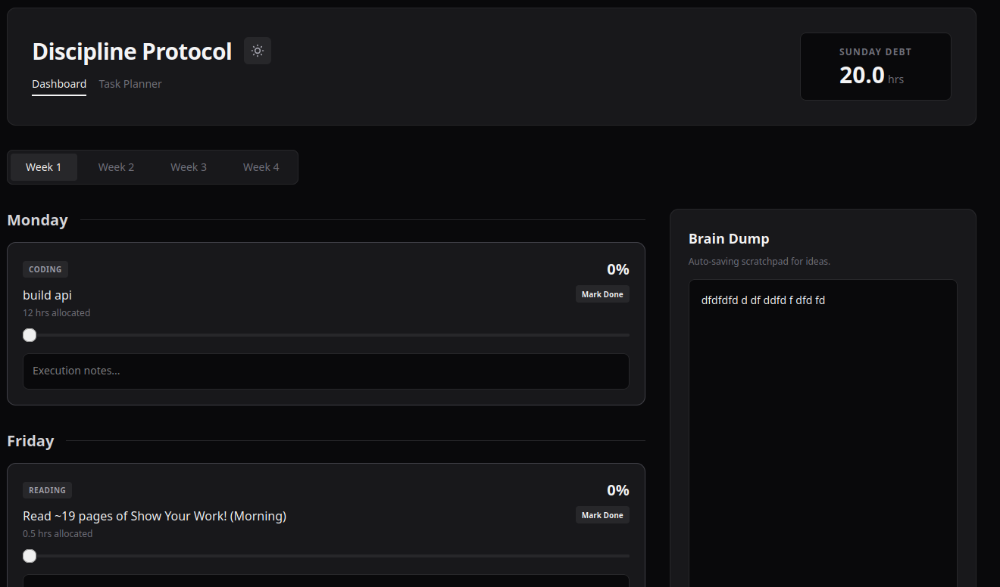
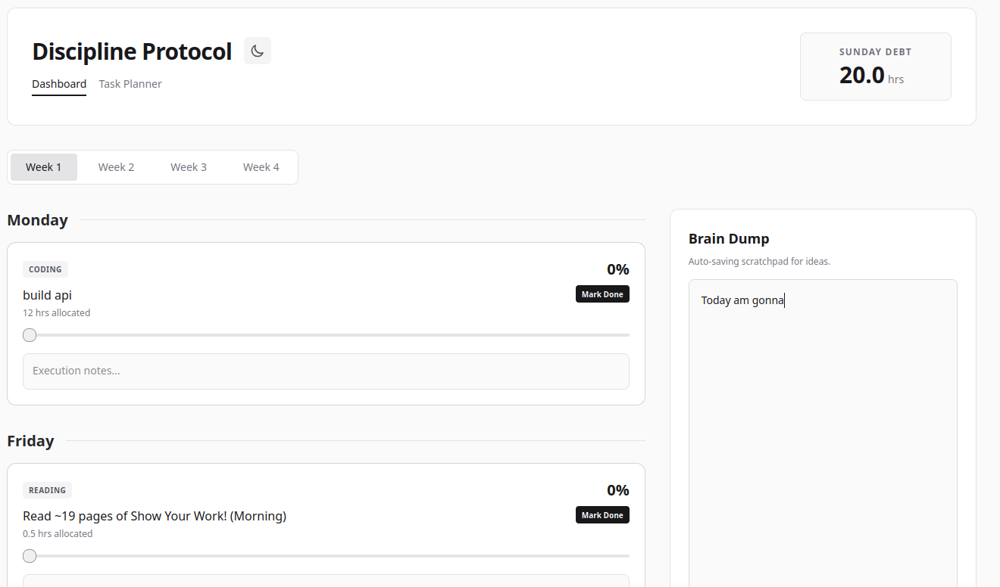
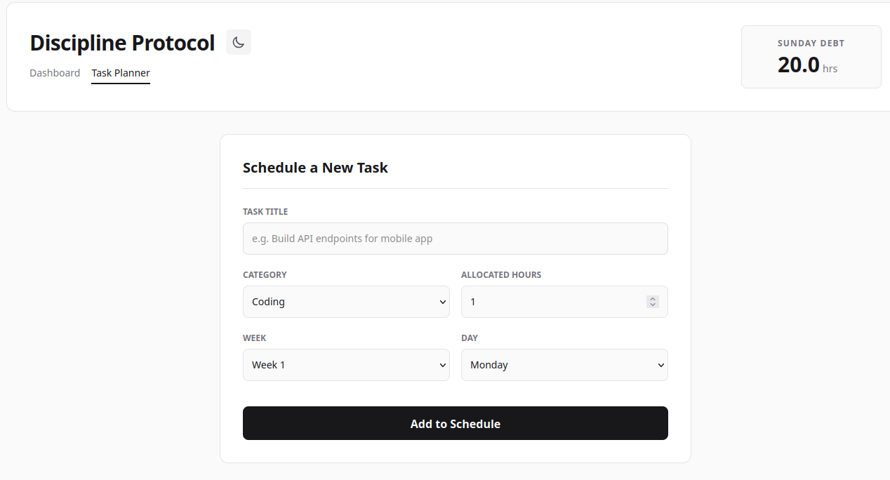

# 30-Day Schedule Tracker

**Live Demo:** https://schedule-tracker-fawn.vercel.app/

A simple React dashboard I built to track my 30-day programming schedule, manage daily tasks, and calculate missed work hours.

## Previews




## Features

* Persistence: Runs entirely in the browser. Uses local storage to automatically save all tasks, progress sliders, theme preferences, and scratchpad notes.
* Debt Engine: Calculates hours from incomplete tasks and aggregates them into a Sunday compensation tracker.
* Two-View Layout: Includes a dashboard for viewing the weekly schedule and a planner form for adding new tasks.
* Theme Toggle: Custom light and dark mode implementation using Tailwind v4 variants.
* Brain Dump: A sticky, auto-saving text area for logging random thoughts or links during deep work.

## Tech Stack

* React (Vite)
* Tailwind CSS v4

## Local Setup

1. Clone the repository:
   ```bash
   git clone git@github.com:fetehadin/scheduleTracker.git

    Install dependencies:
    Bash

    pnpm install

    Start the development server:
    Bash

    pnpm run dev